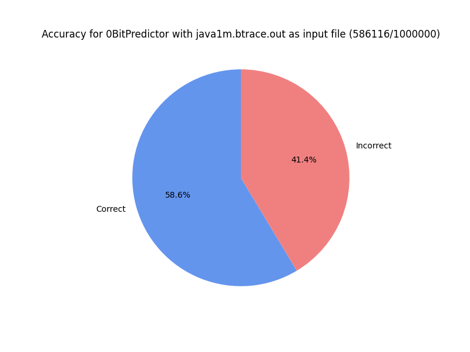
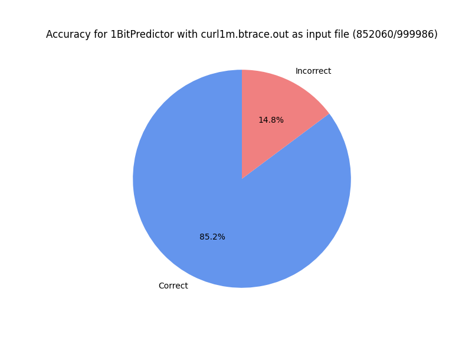

## Beau Albritton
### Branching Prediction

I've compiled each chart for different output files. BHT size ranges. 
 * 256 for gcc100.out
 * 256 for gcc.out
 * 512 for jav1m.out
 * 1024 for curl1m.out
Check the respective directory.

This program computes everything in C++ and then calls a python
script with system calls to use matplotlib. Main executable 
included, but if you want to compile, make sure to include `branching.cpp` i.e.,

* `g++ -o main main.cpp branching.cpp`

